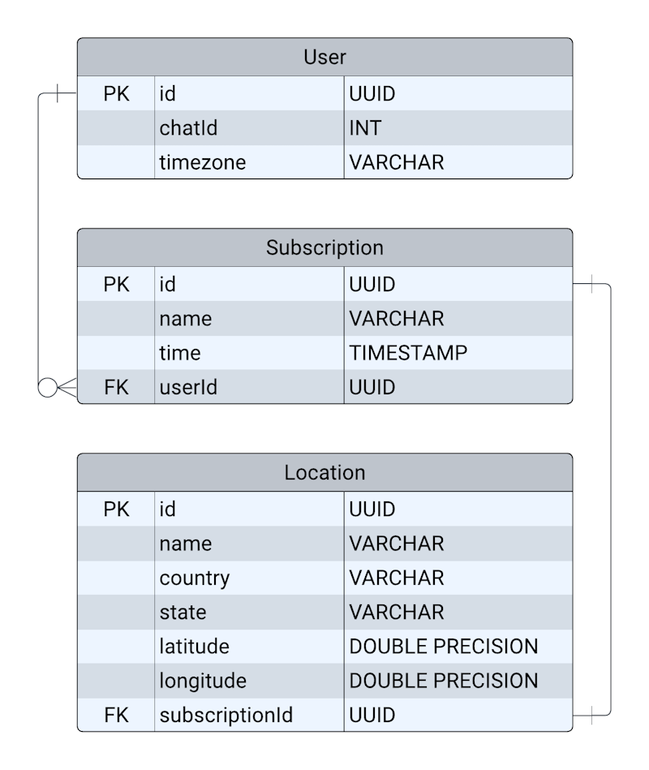

# Subscription Weather Bot

&nbsp;&nbsp;
&nbsp;&nbsp;
&nbsp;&nbsp;
&nbsp;&nbsp;
&nbsp;&nbsp;
&nbsp;&nbsp;

The Telegram bot gives users the ability to create weather forecast
subscriptions for any time.

It interacts with external API [OpenWeather](https://openweathermap.org/api) to
provide up-to-date weather information.

The bot was developed using NestJS, with data storage managed by PostgreSQL
through TypeORM. Task scheduling is implemented using a built-in feature of
NestJS.

You can try it out by passing the
[link](https://t.me/subscription_weather_1_bot) to the bot.

### The bot commands:

- **/start** - for run the bot
- **/help** - provides instructions

Most of your actions in the bot can be done using a keyboard. You can create a
subscription, delete a subscription, set your actual time zone, and see a list
of your subscriptions.

###

---

###

If you want to run the project locally, first, install npm dependencies using
the `npm install` command and set _environment variables_ in the .env file. See
the example in the .env.example file.

### To run the project, use one of the following commands:

```bash
$ npm start

# in development mode
$ npm run start:dev
```

### The bot consists of the following modules:

- bot - bot - this module handles the interaction with the Telegram API through
  the nestjs-telegraf npm package. It implements scenes for a more convenient
  and smooth user experience and interaction.
- user - the module is responsible for managing basic user information, storing
  chatId, and time zone to the DB.
- subscription - used for storing and managing subscriptions.
- cron - this module periodically checks if there are any subscriptions in the
  database for a given time to send it to users.

### DB schema:


