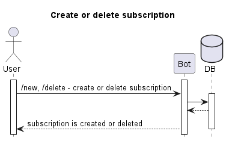
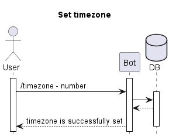
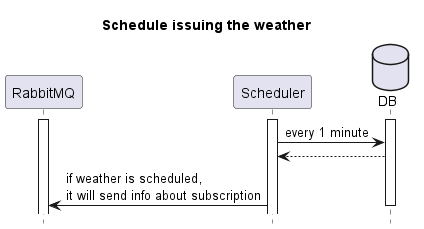
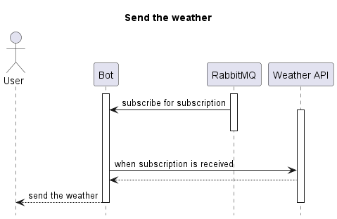

### DB schemas:

- **Users**:
  - userId: uuid
  - chatId: number, unique
  - timezone: string

- **Subscriptions**:
  - subscriptionId: uuid
  - userId: uuid
  - subscriptionName: string
  - time: TIME, unique, index
  - location: string
  - coordinates: string

### Used tools and packages:
- [Nest](https://nestjs.com/) - a Node.js framework
- [telegraph](https://www.npmjs.com/package/telegraf), 
[nestjs-telegraf](https://www.npmjs.com/package/nestjs-telegraf) -
creating bots and integration with NestJS application
- [TypeORM](https://www.npmjs.com/package/typeorm) - an Object-Relational Mapping (ORM) library for TypeScript and JavaScript
- [cron](https://www.npmjs.com/package/cron) - a tool allows to execute something on a schedule
